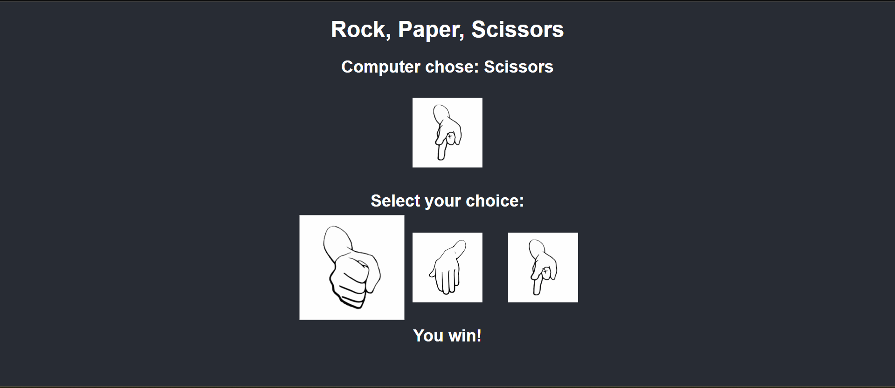

# Rock, Paper, Scissors Game

## Problem Statement

Create a simple web-based Rock, Paper, Scissors game where a user can choose between Rock, Paper, and Scissors. The computer will randomly select one of these options. The game will then determine the winner based on the classic rules of the game.

**Game Rules:**
- Rock beats Scissors.
- Scissors beats Paper.
- Paper beats Rock.
- If both the user and the computer choose the same option, it is a tie.

## Input

- The user selects either Rock, Paper, or Scissors by clicking on corresponding images.
  
## Example Output

1.   
   - **Computer Chooses:** Scissors 
   - **You Choose:** Rock
   - **Result:** You win! Rock beats Scissors.

   ```plaintext
   Computer chose: Scissors
   You chose: Rock
   Result: You win! Rock beats Scissors.

2. - **Test Output**
   - 

## How to Play on Your Local Computer

### Prerequisites
- Python installed ([Download](https://www.python.org/downloads/)).
- Install Flask by running the following command:

  ```bash
  pip install Flask
### Steps to Run:
- Clone or Download the Game Files:
  ```bash
  git clone <repository-url>
- Run the Game:

  ```bash
  python app.py
- Open Your Browser:

   Go to http://127.0.0.1:5000/ to play the game.
   javascript
   
You can replace `<repository-url>` with your actual repository link if needed.